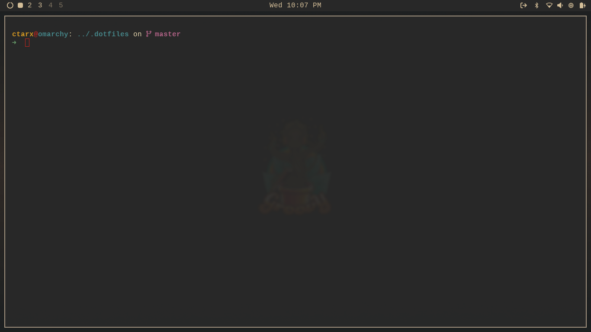

# Omarchy dotfiles

> base configuration files

## Screenshot



## Install

I use GNU Stow [https://www.gnu.org/software/stow](https://www.gnu.org/software/stow)

```shell
cd $HOME
git clone https://github.com/ctarx/omarchy-dotfiles.git ~/.dotfiles
cd ~/.dotfiles
stow home && stow config
```

## Post Install

- [Starship prompt](https://starship.rs/)
- copy 2-gruvbox.jpg
```shell
cp ~/.dotfiles/backgrounds/2-gruvbox.jpg ~/.config/omarchy/themes/gruvbox/backgrounds/2-gruvbox.jpg
```
- [yt-dlp](https://github.com/yt-dlp/yt-dlp/wiki/Installation) 
```
```

### Contact

Created by [@ctarx](https://linuxrocks.online/@ctarx) - feel free to contact me!
