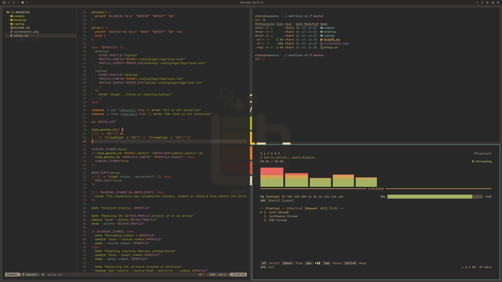

# Omarchy dotfiles

Dotfiles for two Omarchy machines:

- `common` contains configuration shared by both machines.
- `desktop` contains the desktop Hyprland configuration, Waybar, and backup scripts.
- `laptop` contains the laptop Hyprland Lua configuration for Omarchy Quattro.

## Screenshot



## Requirements

- [Omarchy](https://omarchy.org/)
- Git
- [GNU Stow](https://www.gnu.org/software/stow/)

Install any applications referenced by the dotfiles before running the setup.

## Installation

Clone the repository into your home directory:

```bash
git clone https://github.com/ctarx/dotfiles.git "$HOME/.dotfiles"
cd "$HOME/.dotfiles"
```

Install the desktop configuration:

```bash
./setup.sh desktop
```

Install the laptop configuration:

```bash
./setup.sh laptop
```

On the first run, the script adopts files created by Omarchy and then restores
the versions tracked in this repository. The dotfiles therefore replace the
existing Omarchy configuration.

On later runs, the script stows `common` and the selected machine profile.
Only one machine profile is linked at a time.

The repository must be clean before the first installation because
`git restore` is used to make the tracked dotfiles win over adopted files.

## Manual Stow

The equivalent first installation for the desktop is:

```bash
stow --adopt common desktop
git restore --source=HEAD --worktree -- common desktop
stow common desktop
```

For the laptop, replace `desktop` with `laptop`.

## Adding Configuration

To add a program shared by both machines, copy or move its configuration into
the matching path under `common` and run the setup for the current profile. For
example:

```bash
mv "$HOME/.config/foo" "$HOME/.dotfiles/common/.config/foo"
./setup.sh desktop
git add common/.config/foo
```

Use `desktop` or `laptop` instead of `common` when a configuration is specific
to one machine.

## Updating

Pull the repository and run the setup for the machine:

```bash
git pull
./setup.sh desktop
```

Use `laptop` on the laptop.

## Contact

Created by [@ctarx](https://web.libera.chat/). Feel free to reach out!
