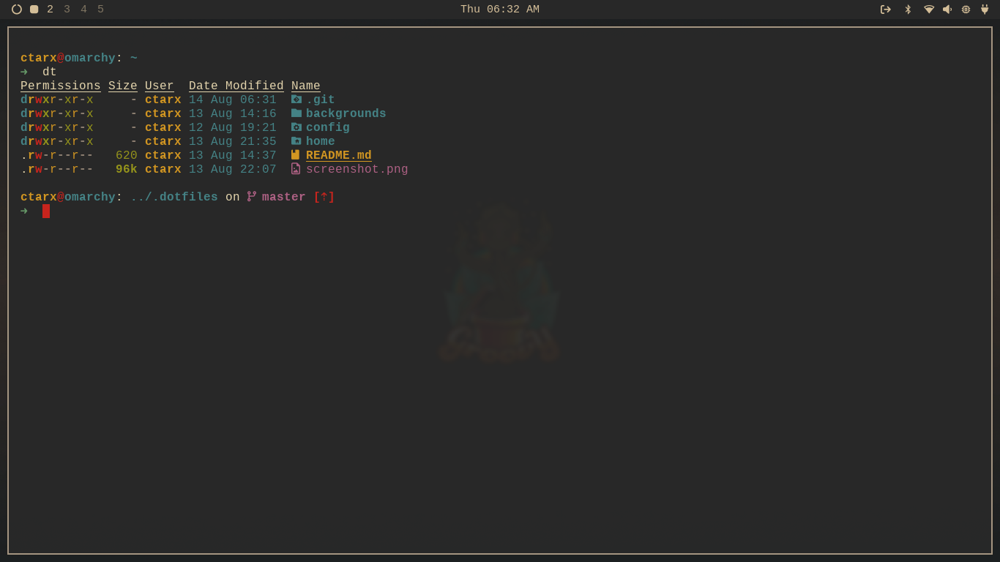

# Omarchy dotfiles

Base configuration files for my Omarchy/Hyprland setup.

## Screenshot



## Prerequisites

- Omarchy installed (Hyprland session)
- Git
- [GNU Stow](https://www.gnu.org/software/stow/)
- [yay](https://github.com/Jguer/yay) (or adjust the script to your helper)

## Quick Start

```bash
cd "$HOME"
git clone https://github.com/ctarx/my-dotfiles.git ~/.dotfiles
cd ~/.dotfiles
./bin/setup.sh
```

`bin/setup.sh` is idempotent and performs everything the old manual steps covered:

1. Restows the `hypr` and `bashrc` directories.
2. Copies `backgrounds/2-gruvbox.jpg` into `~/.config/omarchy/themes/gruvbox/backgrounds/`.
3. Ensures `brave-bin`, `yt-dlp`, and `gvfs-dnssd` are installed via `yay` (without a partial upgrade).

> ℹ️ Starship ships with Omarchy by default (see `omarchy-base.packages`), so no explicit install step is needed here.

## Manual install (optional)

If you prefer to do things step by step:

```bash
cd "$HOME"
git clone https://github.com/ctarx/my-dotfiles.git ~/.dotfiles
cd ~/.dotfiles
stow hypr bashrc
install -Dm644 backgrounds/2-gruvbox.jpg \
  ~/.config/omarchy/themes/gruvbox/backgrounds/2-gruvbox.jpg
yay -S --needed brave-bin yt-dlp gvfs-dnssd
```

## Contact

Created by [@ctarx](https://web.libera.chat/) – feel free to reach out!
